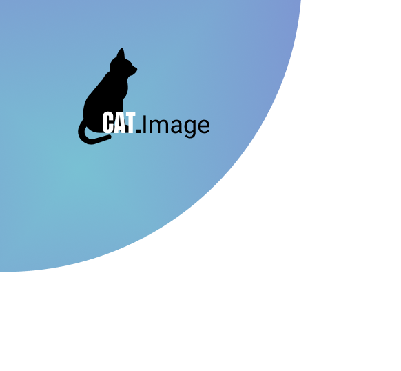

# Cat.Image

### How to lunch the program

### Structure

#### cat_image folder:
  
- categorization folder:
    
    - categorization.py, contains the categorization class that takes care of taking the user's images as input, transforms them on the basis of the parameters required by the model and outputs the prediction of the class they belong   
    - imagenet.classes.txt, contains 1000 classes for the model
    - processing_image.py, takes care of decoding images from base64 and saves them in the user_images folder
    

- main.py, takes care of the connection between backend and frontend. It receives json inputs containing the user's data and photos, performs the validation and sends back a confirmation or not of the same. It also takes care of transferring the final json containing the results of the categorization
    

- validation_data.py, contains the ValidationData class that is responsible for validating: id / email, password, quantity of images and format of the user's images.
It will return True or False

- docs folder:

- tests folder:

- Procfile:   
  describes how to run the application
  

- requirements.txt:   
specifying what python packages are required to run the project